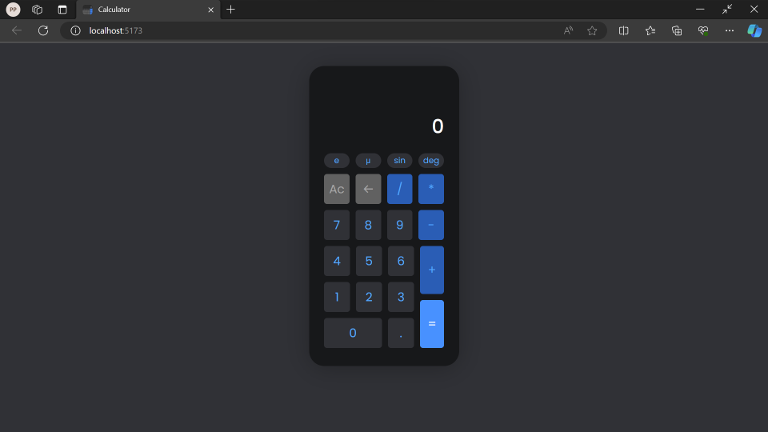

# React Calculator

This project is a simple calculator built with React and TypeScript.

## Features

- Basic arithmetic operations: addition, subtraction, multiplication, division
- Scientific functions: sin, e, μ, deg
- Memory function
- Backspace function

## Installation

1. Clone the repository: `git clone https://github.com/yourusername/react-calculator.git`
2. Navigate into the directory: `cd react-calculator`
3. Install the dependencies: `pnpm install`
4. Start the application: `pnpm start`

## Usage

Open [http://localhost:3000](http://localhost:3000) to view the calculator in the browser.

## Contributing

Pull requests are welcome. For major changes, please open an issue first to discuss what you would like to change.

